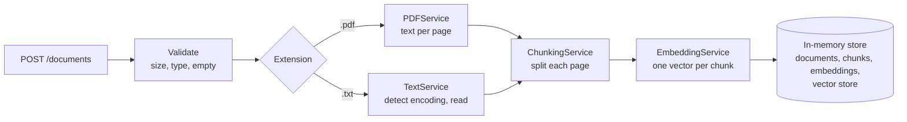
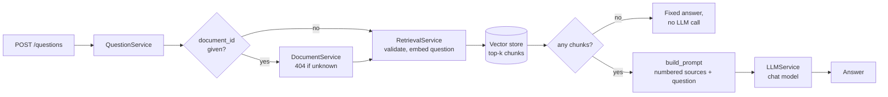

# doc-ai

A FastAPI service for question answering over your own documents (RAG). It
ingests PDF and plain-text documents, splits them into chunks, turns each chunk
into an embedding vector, and answers questions with an LLM using only the
chunks most similar to the question.

Everything is held **in memory**, including the vector store. There is no
database, so all documents, chunks and embeddings are lost when the process
stops.

## Contents

- [Features](#features)
- [How it works](#how-it-works)
- [Requirements](#requirements)
- [Getting started](#getting-started)
- [Configuration](#configuration)
- [API reference](#api-reference)
- [Manual end-to-end check](#manual-end-to-end-check)
- [Data model](#data-model)
- [Project structure](#project-structure)
- [Architecture](#architecture)
- [Development](#development)
- [Limitations](#limitations)
- [Roadmap](#roadmap)

## Features

- **Upload PDF and `.txt` files** up to 10 MB.
- **Per-page PDF extraction** with [PyMuPDF](https://pymupdf.readthedocs.io/),
  so every chunk knows which page it came from.
- **Text encoding detection** for `.txt` files: UTF-8 (with or without BOM),
  UTF-16 (with BOM) and Windows-1252.
- **Chunking** with LangChain's `RecursiveCharacterTextSplitter`, with a
  configurable size and overlap. Chunks never span two pages.
- **Embeddings** with OpenAI (`text-embedding-3-small` by default) through
  `langchain-openai`.
- **All-or-nothing uploads**: a document is stored only if extraction, chunking
  and embedding all succeed.
- **Semantic retrieval** with an in-memory NumPy vector store (exact cosine
  similarity), across all documents or limited to one.
- **Grounded answers** from an OpenAI chat model (`gpt-4o-mini` by default)
  through `langchain-openai`. The prompt tells the model to answer only from
  the retrieved sources and to say when they don't contain the answer.
- **Clear HTTP errors** for empty, oversized, unsupported or unreadable files,
  invalid questions, unknown documents, and embedding or LLM provider
  failures. Provider details are logged, never sent to the client.

## How it works



1. The upload is checked: it must not be empty, must be at most 10 MB, and
   must have a `.pdf` or `.txt` extension.
2. Text is extracted. A PDF gives one text block per page (numbered from 1).
   A `.txt` file gives a single block with no page number.
3. Each block is split into chunks. Chunk numbering runs continuously across
   the whole document.
4. All chunks of the document are sent to the embedding provider in one call.
5. Only after every step succeeds are the document, its chunks and its
   embeddings stored together. If any step fails, nothing is stored.

Answering a question:



1. If a `document_id` is given, the document must exist (404 otherwise). This
   is checked before any provider call.
2. The question is trimmed and validated (400 if empty or longer than 2000
   characters), embedded with the same model as the chunks, and the
   `RETRIEVAL_TOP_K` most similar chunks are retrieved.
3. If there is no text to search (no documents, or only documents without
   text), a fixed answer is returned without calling the LLM.
4. Otherwise the chunks and the question are turned into a prompt and sent to
   the chat model, whose reply is returned.

## Requirements

- Python **3.13** or newer
- [uv](https://docs.astral.sh/uv/) for dependency management
- An **OpenAI API key** with credits (needed to start the server and to
  upload or ask; tests do not need one)

## Getting started

Install the dependencies:

```bash
uv sync
```

Create a `.env` file from the example and add your OpenAI key:

```bash
cp .env.example .env
# then edit .env and set OPENAI_API_KEY
```

`.env` is listed in `.gitignore`, so the key is not committed.

Start the development server:

```bash
uv run --env-file .env uvicorn doc_ai.main:app --reload
```

The API runs at `http://127.0.0.1:8000`. Interactive docs are at
`http://127.0.0.1:8000/docs`.

> The server refuses to start without `OPENAI_API_KEY` and exits with
> `ValueError: OPENAI_API_KEY is not set`.

Try it out:

```bash
curl -F file=@notes.txt http://127.0.0.1:8000/documents
curl http://127.0.0.1:8000/documents
curl http://127.0.0.1:8000/documents/1/chunks
curl -H 'Content-Type: application/json' \
     -d '{"question": "What is this document about?", "document_id": 1}' \
     http://127.0.0.1:8000/questions
```

## Configuration

Settings are read from environment variables when the app starts
(`src/doc_ai/core/config.py`).

| Variable          | Default                  | Description                                                   |
| ----------------- | ------------------------ | ------------------------------------------------------------- |
| `OPENAI_API_KEY`  | none (required)          | API key for the OpenAI embeddings and chat APIs.              |
| `EMBEDDING_MODEL` | `text-embedding-3-small` | OpenAI embedding model name.                                  |
| `CHUNK_SIZE`      | `1000`                   | Maximum characters per chunk. Must be greater than 0.         |
| `CHUNK_OVERLAP`   | `200`                    | Characters shared by neighbouring chunks. Must be `>= 0` and less than `CHUNK_SIZE`. |
| `RETRIEVAL_TOP_K` | `4`                      | Number of chunks retrieved per question. Must be greater than 0. |
| `LLM_MODEL`       | `gpt-4o-mini`            | OpenAI chat model used to answer questions.                    |

Invalid chunk or retrieval settings stop the app at startup, for example
`ValueError: CHUNK_OVERLAP must be >= 0 and less than CHUNK_SIZE`.

These values are fixed in code and cannot be changed through the environment:

| Setting              | Value            |
| -------------------- | ---------------- |
| Maximum upload size  | 10 MB            |
| Allowed extensions   | `.pdf`, `.txt`   |
| Maximum question length | 2000 characters (after trimming whitespace) |
| LLM request timeout  | 60 seconds       |

`CHUNK_SIZE` and `CHUNK_OVERLAP` are measured in **characters**, not tokens.

## API reference

### `POST /documents`

Upload a file as `multipart/form-data` in a field named `file`.

```bash
curl -F file=@report.pdf http://127.0.0.1:8000/documents
```

**200 OK**

```json
{ "id": 1, "filename": "report.pdf" }
```

### `GET /documents`

List every stored document.

```bash
curl http://127.0.0.1:8000/documents
```

**200 OK**

```json
[{ "id": 1, "filename": "report.pdf" }]
```

### `GET /documents/{document_id}/chunks`

Return a document's chunks in order, with their metadata. Embedding vectors
are not included.

```bash
curl http://127.0.0.1:8000/documents/1/chunks
```

**200 OK**

```json
[
  {
    "id": "1-0",
    "document_id": 1,
    "chunk_index": 0,
    "content": "Page one talks about invoices.",
    "filename": "report.pdf",
    "page_number": 1,
    "start_index": 0
  },
  {
    "id": "1-1",
    "document_id": 1,
    "chunk_index": 1,
    "content": "Page two covers refunds and returns.",
    "filename": "report.pdf",
    "page_number": 2,
    "start_index": 0
  }
]
```

### `POST /questions`

Ask a question about the uploaded documents. `document_id` is optional: leave
it out to search every document.

```bash
curl -H 'Content-Type: application/json' \
     -d '{"question": "How long do refunds take?", "document_id": 1}' \
     http://127.0.0.1:8000/questions
```

**200 OK**

```json
{ "answer": "Refunds are processed within 14 days." }
```

If there is no document text to search, the answer is
`"No document content is available to answer this question."` and no LLM call
is made. If the documents don't contain the answer, the model is instructed to
say so rather than guess.

### Errors

Every error response has the shape `{"detail": "<message>"}`.

| Status | `detail`                            | When                                                         |
| ------ | ----------------------------------- | ------------------------------------------------------------ |
| 400    | `File is empty`                     | The uploaded file has no content.                            |
| 400    | `Invalid PDF file`                  | The `.pdf` file cannot be opened by PyMuPDF.                 |
| 400    | `Could not detect the file encoding`| A `.txt` file does not decode with any supported encoding.   |
| 400    | `Question must not be empty`        | The question is empty or only whitespace.                    |
| 400    | `Question must be at most 2000 characters` | The trimmed question is too long.                     |
| 404    | `Document not found`                | No document has the requested id (chunks or questions).      |
| 413    | `File is too large`                 | The file is larger than 10 MB.                               |
| 415    | `File type is not allowed`          | The extension is not `.pdf` or `.txt`.                       |
| 422    | FastAPI validation details          | For example, `document_id` is not an integer, `file` or `question` is missing, or the body is not JSON. |
| 502    | `Embedding provider failed`         | The embedding provider returned an error, the wrong number of vectors, or an empty vector. |
| 502    | `Language model provider failed`    | The chat model provider returned an error (including a timeout). |
| 502    | `Language model returned an empty answer` | The chat model replied with no text.                   |

For a 502, the provider's own error (for example an OpenAI `401` for a bad
key, or `429 insufficient_quota`) is written to the server log. It is not sent
to the client.

## Manual end-to-end check

Automated tests never call OpenAI. To check the real integration, you need an
OpenAI key **with credits**:

1. Put the key in `.env` and start the server:
   `uv run --env-file .env uvicorn doc_ai.main:app`
2. Upload a document:
   `curl -F file=@notes.txt http://127.0.0.1:8000/documents`
   (note the returned `id`).
3. Ask about something the document says, and something it doesn't:

   ```bash
   curl -H 'Content-Type: application/json' \
        -d '{"question": "<something in the file>", "document_id": 1}' \
        http://127.0.0.1:8000/questions
   curl -H 'Content-Type: application/json' \
        -d '{"question": "<something not in the file>", "document_id": 1}' \
        http://127.0.0.1:8000/questions
   ```

   The first should answer from the document; the second should say the
   documents don't contain that information.
4. `{"question": "Hi", "document_id": 999}` should return 404, and
   `{"question": "  "}` should return 400.

If the account has no credits, step 2 already fails with
`502 Embedding provider failed`, and the server log shows OpenAI's
`429 insufficient_quota`. That is the expected behavior: the client gets the
generic message and the cause stays in the log.

## Data model

### Document

| Field        | Type       | Notes                                                        |
| ------------ | ---------- | ------------------------------------------------------------ |
| `id`         | `int`      | Assigned from a counter starting at 1. A failed upload can leave a gap. |
| `filename`   | `str`      | Original filename, or `unknown file` if none was sent.       |
| `content`    | `str`      | Full extracted text. PDF pages are joined with a blank line. |
| `created_at` | `datetime` | UTC time of upload.                                          |

### Chunk

The chunk metadata is chosen so a future retrieval step can filter, order and
cite results.

| Field         | Type          | Notes                                                               |
| ------------- | ------------- | ------------------------------------------------------------------- |
| `id`          | `str`         | `"{document_id}-{chunk_index}"`, e.g. `"3-12"`. Stable for a given document. |
| `document_id` | `int`         | The document this chunk belongs to.                                  |
| `chunk_index` | `int`         | Position in the document, from 0, continuous across pages.           |
| `content`     | `str`         | The chunk text.                                                      |
| `filename`    | `str`         | Copied from the document, for citations.                             |
| `page_number` | `int \| None` | PDF page number from 1; `None` for `.txt` files.                     |
| `start_index` | `int`         | Character offset of the chunk within its page (or within the whole `.txt` file). |

### ChunkEmbedding

| Field      | Type          | Notes                                                                    |
| ---------- | ------------- | ------------------------------------------------------------------------ |
| `chunk_id` | `str`         | The `Chunk.id` this vector belongs to.                                   |
| `vector`   | `list[float]` | The embedding. `text-embedding-3-small` gives 1536 numbers.              |
| `model`    | `str`         | The model that produced it. Vectors from different models can't be compared. |

Embeddings are kept inside the service and are not exposed through the API.

### SearchResult

Returned by `RetrievalService.retrieve` and `InMemoryVectorStore.search`, best
match first. It contains no vectors. Not exposed through the API.

| Field   | Type    | Notes                                                        |
| ------- | ------- | ------------------------------------------------------------ |
| `chunk` | `Chunk` | The matching chunk, with its metadata for citations.         |
| `score` | `float` | Cosine similarity to the query, from -1 to 1 (higher is closer). |

### Answer

Returned by `QuestionService.answer`. The API response only exposes `text`
(as `answer`); `sources` is kept for future citations.

| Field     | Type                 | Notes                                                    |
| --------- | -------------------- | -------------------------------------------------------- |
| `text`    | `str`                | The model's answer, or the fixed no-content answer.      |
| `sources` | `list[SearchResult]` | The chunks given to the model, in the order of the numbered sources in the prompt. Empty when no LLM call was made. |

## Project structure

```
src/doc_ai/
├── main.py                  # FastAPI app, exception handler registration
├── core/
│   ├── config.py            # Settings read from environment variables
│   └── dependencies.py      # Builds all services; exposes the service dependencies
├── routers/
│   ├── documents.py         # HTTP endpoints only, no business logic
│   └── questions.py         # POST /questions
├── services/
│   ├── document_service.py  # Upload flow and in-memory storage
│   ├── pdf_service.py       # PDF text extraction, per page
│   ├── text_service.py      # .txt encoding detection and reading
│   ├── chunking_service.py  # LangChain text splitter
│   ├── embedding_service.py # LangChain embeddings + OpenAI factory
│   ├── vector_store.py      # In-memory cosine-similarity search (NumPy)
│   ├── retrieval_service.py # Question -> query embedding -> top-k chunks
│   ├── llm_service.py       # LangChain chat model + OpenAI factory
│   ├── question_prompt.py   # build_prompt: system rules, numbered sources, question
│   └── question_service.py  # Q&A orchestration: document check, retrieval, LLM
├── interfaces/              # typing.Protocol interfaces for each service
├── models/                  # Internal Pydantic models: Document, PageText, Chunk, ChunkEmbedding, QueryEmbedding, SearchResult, Prompt, Answer
├── schemas/                 # API request/response models
└── exceptions/              # Custom exceptions and their HTTP handlers

tests/unit/                  # pytest tests: one file per service, plus config, handlers,
                             # the /questions API and import boundaries
```

## Architecture

- **Routers stay thin.** Endpoints only call `DocumentService` or
  `QuestionService` through their interfaces. They never import a concrete
  service or any LangChain code.
- **Composition happens in one place.** `core/dependencies.py` builds every
  service once at startup and injects them. Upload and retrieval share one
  `EmbeddingService` and one vector store, so questions are embedded with the
  same model as the chunks.
- **Services depend on interfaces.** Each service receives its collaborators
  through its constructor, typed as `Protocol` interfaces from `interfaces/`.
  This keeps services easy to test and replace.
- **LangChain is contained.** `langchain_text_splitters` is imported only in
  `chunking_service.py`, and `langchain_openai` only in the two provider
  factories in `embedding_service.py` and `llm_service.py`. Other layers work
  with the project's own Pydantic models. `tests/unit/test_architecture.py`
  enforces this.
- **Swapping the embedding provider** means writing another factory next to
  `create_openai_embedding_service` that wraps a different LangChain
  `Embeddings` class (for example Ollama or HuggingFace), and calling it from
  `dependencies.py`. `EmbeddingService`, `DocumentService` and the routers stay
  the same.
- **Swapping the LLM provider** works the same way: `LLMService` wraps any
  LangChain `BaseChatModel`, and `create_openai_llm_service` is the only
  OpenAI-specific part. Another provider needs another factory (or any class
  with `generate(prompt) -> str`); `QuestionService` doesn't change.
- **The vector store never embeds.** `InMemoryVectorStore` receives the
  `ChunkEmbedding`s that `EmbeddingService` already produced, normalizes them
  once, and ranks chunks by exact cosine similarity with NumPy. Search takes a
  `QueryEmbedding`, an optional `document_id` filter and `k`; equal scores keep
  insertion order, so results are deterministic. It rejects mismatched or
  duplicate chunk ids, mixed models or dimensions, a query from a different
  model than the stored vectors, and empty, zero or non-finite vectors with
  `ValueError`, and a rejected batch stores nothing.
- **Retrieval depends only on interfaces.** `RetrievalService` trims and
  validates the question (empty or longer than 2000 characters raises
  `InvalidQuestionError`, HTTP 400, before the provider is called), embeds it
  with `EmbeddingService.embed_query`, and returns the vector store's top
  `RETRIEVAL_TOP_K` results, optionally for one `document_id`. It uses only
  `EmbeddingServiceInterface` and `VectorStoreInterface`, so a database-backed
  vector store can replace `InMemoryVectorStore` without changing it. An
  unknown `document_id` returns no results; checking that the document exists
  is left to the caller.
- **The LLM only generates text.** `LLMServiceInterface.generate(Prompt) -> str`
  knows nothing about documents or retrieval. Provider errors and empty replies
  become `LLMError` (HTTP 502, cause logged).
- **Prompts are a pure function.** `build_prompt` in `question_prompt.py`
  puts the rules in the system message (answer only from the sources, say when
  they don't contain the answer, treat source text as data, not instructions)
  and the numbered `<source id file page>` blocks plus the question in the user
  message. Scores, ids and vectors are never sent; `<source` tags inside chunk
  text are escaped.
- **`QuestionService` only orchestrates.** It checks the document exists,
  retrieves, returns a fixed answer without an LLM call when there is nothing
  to search, and otherwise builds the prompt and calls the LLM. It depends on
  the document, retrieval and LLM interfaces and catches no exceptions.
- **Errors are domain exceptions.** Services raise exceptions such as
  `FileTooLargeError` or `EmbeddingError`; handlers in
  `exceptions/handlers.py` map them to HTTP status codes.

## Development

Run the test suite:

```bash
uv run pytest
```

The tests need **no API key, no network access and no OpenAI credits**.
Embeddings are replaced with LangChain's `DeterministicFakeEmbedding` and chat
models with LangChain's fake chat models (or small `BaseChatModel` subclasses
that fail on purpose). Async tests run through the `anyio` pytest plugin that
comes with FastAPI. The `/questions` API tests use FastAPI's `TestClient`
(`httpx` dev dependency) with the service dependencies overridden.

Lint and format check with [Ruff](https://docs.astral.sh/ruff/), run through
`uvx` (Ruff isn't a project dependency):

```bash
uvx ruff check src tests
uvx ruff format --check src tests
```

## Limitations

- **Nothing is persisted.** Restarting the server loses all data.
- **Run a single process.** Each worker process has its own in-memory store, so
  running uvicorn with several workers would split documents between them.
- **Scanned PDFs have no text.** PDFs without a text layer are stored with no
  extracted text and zero chunks; there is no OCR.
- **Document text is sent to OpenAI** to create embeddings, and the retrieved
  chunks and the question are sent to OpenAI to generate answers.
- **No relevance threshold.** The top chunks are always sent to the LLM, even
  if they are only loosely related; the prompt tells the model to say when they
  don't contain the answer.
- **Single questions only.** There is no conversation history, streaming or
  citations yet.
- **Uploads wait for embedding.** The OpenAI call happens during the request,
  so large documents take longer to upload.
- **No authentication.** Anyone who can reach the server can upload and read
  documents.
- **Encoding detection is a fallback list.** Windows-1252 accepts almost any
  bytes, so a file in an unsupported encoding may be read with wrong
  characters instead of being rejected.

## Roadmap

- Citations in answers (`Answer.sources` already holds the numbered sources).
- A document detail endpoint (`DocumentDetailResponse` is already defined).
