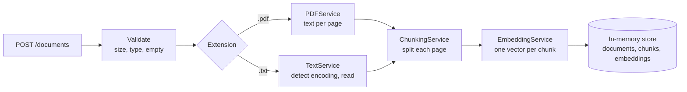

# doc-ai

A FastAPI service that ingests PDF and plain-text documents, splits them into
chunks, and turns each chunk into an embedding vector. It is the ingestion half
of a document question-answering (RAG) system: retrieval and LLM answers are
planned but not built yet.

Everything is held **in memory**. There is no database and no vector store, so
all documents, chunks and embeddings are lost when the process stops.

## Contents

- [Features](#features)
- [How it works](#how-it-works)
- [Requirements](#requirements)
- [Getting started](#getting-started)
- [Configuration](#configuration)
- [API reference](#api-reference)
- [Data model](#data-model)
- [Project structure](#project-structure)
- [Architecture](#architecture)
- [Development](#development)
- [Limitations](#limitations)
- [Roadmap](#roadmap)

## Features

- **Upload PDF and `.txt` files** up to 10 MB.
- **Per-page PDF extraction** with [PyMuPDF](https://pymupdf.readthedocs.io/),
  so every chunk knows which page it came from.
- **Text encoding detection** for `.txt` files: UTF-8 (with or without BOM),
  UTF-16 (with BOM) and Windows-1252.
- **Chunking** with LangChain's `RecursiveCharacterTextSplitter`, with a
  configurable size and overlap. Chunks never span two pages.
- **Embeddings** with OpenAI (`text-embedding-3-small` by default) through
  `langchain-openai`.
- **All-or-nothing uploads**: a document is stored only if extraction, chunking
  and embedding all succeed.
- **Clear HTTP errors** for empty, oversized, unsupported or unreadable files,
  and for embedding provider failures.

## How it works



1. The upload is checked: it must not be empty, must be at most 10 MB, and
   must have a `.pdf` or `.txt` extension.
2. Text is extracted. A PDF gives one text block per page (numbered from 1).
   A `.txt` file gives a single block with no page number.
3. Each block is split into chunks. Chunk numbering runs continuously across
   the whole document.
4. All chunks of the document are sent to the embedding provider in one call.
5. Only after every step succeeds are the document, its chunks and its
   embeddings stored together. If any step fails, nothing is stored.

## Requirements

- Python **3.13** or newer
- [uv](https://docs.astral.sh/uv/) for dependency management
- An **OpenAI API key** (needed to start the server; tests do not need one)

## Getting started

Install the dependencies:

```bash
uv sync
```

Create a `.env` file from the example and add your OpenAI key:

```bash
cp .env.example .env
# then edit .env and set OPENAI_API_KEY
```

`.env` is listed in `.gitignore`, so the key is not committed.

Start the development server:

```bash
uv run --env-file .env uvicorn doc_ai.main:app --reload
```

The API runs at `http://127.0.0.1:8000`. Interactive docs are at
`http://127.0.0.1:8000/docs`.

> The server refuses to start without `OPENAI_API_KEY` and exits with
> `ValueError: OPENAI_API_KEY is not set`.

Try it out:

```bash
curl -F file=@notes.txt http://127.0.0.1:8000/documents
curl http://127.0.0.1:8000/documents
curl http://127.0.0.1:8000/documents/1/chunks
```

## Configuration

Settings are read from environment variables when the app starts
(`src/doc_ai/core/config.py`).

| Variable          | Default                  | Description                                                   |
| ----------------- | ------------------------ | ------------------------------------------------------------- |
| `OPENAI_API_KEY`  | none (required)          | API key for the OpenAI embeddings API.                        |
| `EMBEDDING_MODEL` | `text-embedding-3-small` | OpenAI embedding model name.                                  |
| `CHUNK_SIZE`      | `1000`                   | Maximum characters per chunk. Must be greater than 0.         |
| `CHUNK_OVERLAP`   | `200`                    | Characters shared by neighbouring chunks. Must be `>= 0` and less than `CHUNK_SIZE`. |

Invalid chunk settings stop the app at startup, for example
`ValueError: CHUNK_OVERLAP must be >= 0 and less than CHUNK_SIZE`.

These values are fixed in code and cannot be changed through the environment:

| Setting              | Value            |
| -------------------- | ---------------- |
| Maximum upload size  | 10 MB            |
| Allowed extensions   | `.pdf`, `.txt`   |

`CHUNK_SIZE` and `CHUNK_OVERLAP` are measured in **characters**, not tokens.

## API reference

### `POST /documents`

Upload a file as `multipart/form-data` in a field named `file`.

```bash
curl -F file=@report.pdf http://127.0.0.1:8000/documents
```

**200 OK**

```json
{ "id": 1, "filename": "report.pdf" }
```

### `GET /documents`

List every stored document.

```bash
curl http://127.0.0.1:8000/documents
```

**200 OK**

```json
[{ "id": 1, "filename": "report.pdf" }]
```

### `GET /documents/{document_id}/chunks`

Return a document's chunks in order, with their metadata. Embedding vectors
are not included.

```bash
curl http://127.0.0.1:8000/documents/1/chunks
```

**200 OK**

```json
[
  {
    "id": "1-0",
    "document_id": 1,
    "chunk_index": 0,
    "content": "Page one talks about invoices.",
    "filename": "report.pdf",
    "page_number": 1,
    "start_index": 0
  },
  {
    "id": "1-1",
    "document_id": 1,
    "chunk_index": 1,
    "content": "Page two covers refunds and returns.",
    "filename": "report.pdf",
    "page_number": 2,
    "start_index": 0
  }
]
```

### Errors

Every error response has the shape `{"detail": "<message>"}`.

| Status | `detail`                            | When                                                         |
| ------ | ----------------------------------- | ------------------------------------------------------------ |
| 400    | `File is empty`                     | The uploaded file has no content.                            |
| 400    | `Invalid PDF file`                  | The `.pdf` file cannot be opened by PyMuPDF.                 |
| 400    | `Could not detect the file encoding`| A `.txt` file does not decode with any supported encoding.   |
| 404    | `Document not found`                | No document has the requested id.                            |
| 413    | `File is too large`                 | The file is larger than 10 MB.                               |
| 415    | `File type is not allowed`          | The extension is not `.pdf` or `.txt`.                       |
| 422    | FastAPI validation details          | For example, `document_id` is not an integer or `file` is missing. |
| 502    | `Embedding provider failed`         | The embedding provider returned an error, or the wrong number of vectors. |

For a 502, the provider's own error (for example an OpenAI `401` for a bad
key, or a rate limit) is written to the server log. It is not sent to the
client.

## Data model

### Document

| Field        | Type       | Notes                                                        |
| ------------ | ---------- | ------------------------------------------------------------ |
| `id`         | `int`      | Assigned from a counter starting at 1. A failed upload can leave a gap. |
| `filename`   | `str`      | Original filename, or `unknown file` if none was sent.       |
| `content`    | `str`      | Full extracted text. PDF pages are joined with a blank line. |
| `created_at` | `datetime` | UTC time of upload.                                          |

### Chunk

The chunk metadata is chosen so a future retrieval step can filter, order and
cite results.

| Field         | Type          | Notes                                                               |
| ------------- | ------------- | ------------------------------------------------------------------- |
| `id`          | `str`         | `"{document_id}-{chunk_index}"`, e.g. `"3-12"`. Stable for a given document. |
| `document_id` | `int`         | The document this chunk belongs to.                                  |
| `chunk_index` | `int`         | Position in the document, from 0, continuous across pages.           |
| `content`     | `str`         | The chunk text.                                                      |
| `filename`    | `str`         | Copied from the document, for citations.                             |
| `page_number` | `int \| None` | PDF page number from 1; `None` for `.txt` files.                     |
| `start_index` | `int`         | Character offset of the chunk within its page (or within the whole `.txt` file). |

### ChunkEmbedding

| Field      | Type          | Notes                                                                    |
| ---------- | ------------- | ------------------------------------------------------------------------ |
| `chunk_id` | `str`         | The `Chunk.id` this vector belongs to.                                   |
| `vector`   | `list[float]` | The embedding. `text-embedding-3-small` gives 1536 numbers.              |
| `model`    | `str`         | The model that produced it. Vectors from different models can't be compared. |

Embeddings are kept inside the service and are not exposed through the API.

## Project structure

```
src/doc_ai/
├── main.py                  # FastAPI app, exception handler registration
├── core/
│   ├── config.py            # Settings read from environment variables
│   └── dependencies.py      # Builds all services; exposes DocumentServiceDependency
├── routers/
│   └── documents.py         # HTTP endpoints only, no business logic
├── services/
│   ├── document_service.py  # Upload flow and in-memory storage
│   ├── pdf_service.py       # PDF text extraction, per page
│   ├── text_service.py      # .txt encoding detection and reading
│   ├── chunking_service.py  # LangChain text splitter
│   └── embedding_service.py # LangChain embeddings + OpenAI factory
├── interfaces/              # typing.Protocol interfaces for each service
├── models/                  # Internal Pydantic models: Document, PageText, Chunk, ChunkEmbedding
├── schemas/                 # API request/response models
└── exceptions/              # Custom exceptions and their HTTP handlers

tests/unit/                  # pytest unit tests, one file per service plus config and handlers
```

## Architecture

- **Routers stay thin.** Endpoints only call `DocumentService`. They never
  import a concrete service or any LangChain code.
- **Composition happens in one place.** `core/dependencies.py` builds every
  service once at startup and injects them into `DocumentService`.
- **Services depend on interfaces.** Each service receives its collaborators
  through its constructor, typed as `Protocol` interfaces from `interfaces/`.
  This keeps services easy to test and replace.
- **LangChain is contained.** `langchain_text_splitters` is imported only in
  `chunking_service.py`, and `langchain_openai` only in `embedding_service.py`.
  Other layers work with the project's own Pydantic models.
- **Swapping the embedding provider** means writing another factory next to
  `create_openai_embedding_service` that wraps a different LangChain
  `Embeddings` class (for example Ollama or HuggingFace), and calling it from
  `dependencies.py`. `EmbeddingService`, `DocumentService` and the routers stay
  the same.
- **Errors are domain exceptions.** Services raise exceptions such as
  `FileTooLargeError` or `EmbeddingError`; handlers in
  `exceptions/handlers.py` map them to HTTP status codes.

## Development

Run the test suite:

```bash
uv run pytest
```

The tests need **no API key and no network access**. Embeddings are
replaced with LangChain's `DeterministicFakeEmbedding` (this is why `numpy` is
a dev dependency). Async tests run through the `anyio` pytest plugin that comes
with FastAPI.

Lint and format check with [Ruff](https://docs.astral.sh/ruff/), run through
`uvx` (Ruff isn't a project dependency):

```bash
uvx ruff check src tests
uvx ruff format --check src tests
```

## Limitations

- **Nothing is persisted.** Restarting the server loses all data.
- **Run a single process.** Each worker process has its own in-memory store, so
  running uvicorn with several workers would split documents between them.
- **Scanned PDFs have no text.** PDFs without a text layer are stored with no
  extracted text and zero chunks; there is no OCR.
- **Document text is sent to OpenAI** to create embeddings.
- **Uploads wait for embedding.** The OpenAI call happens during the request,
  so large documents take longer to upload.
- **No authentication.** Anyone who can reach the server can upload and read
  documents.
- **Encoding detection is a fallback list.** Windows-1252 accepts almost any
  bytes, so a file in an unsupported encoding may be read with wrong
  characters instead of being rejected.

## Roadmap

- Store embeddings in a vector store.
- Semantic retrieval: embed a question with the same model and find the most
  similar chunks.
- LLM question answering over the retrieved chunks (`QuestionRequest` and
  `QuestionResponse` in `schemas/question.py` are already defined for this).
- A document detail endpoint (`DocumentDetailResponse` is already defined).
